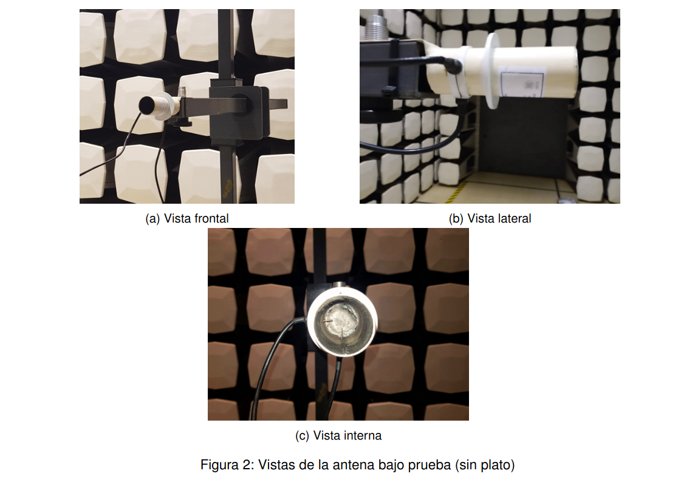
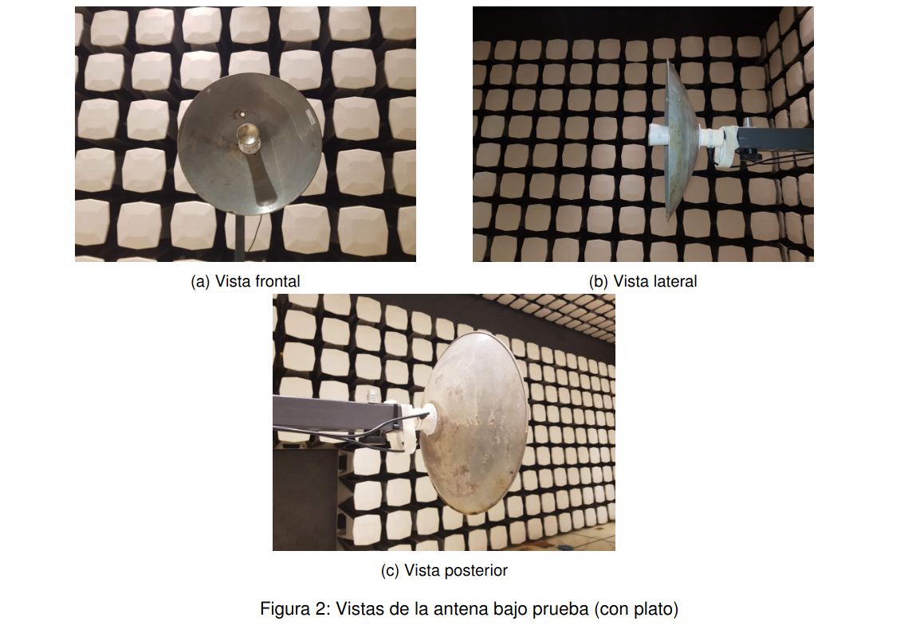
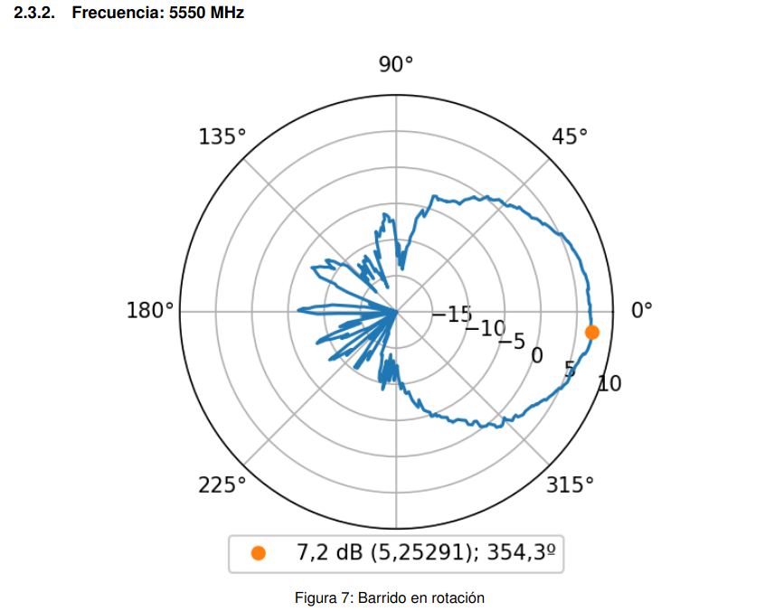
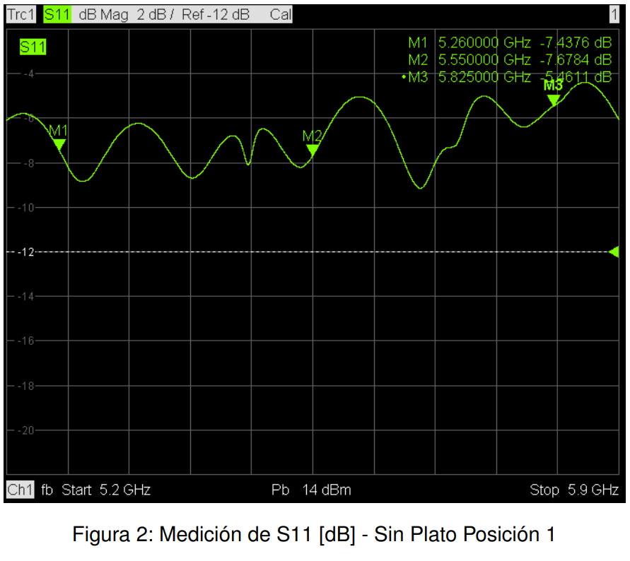
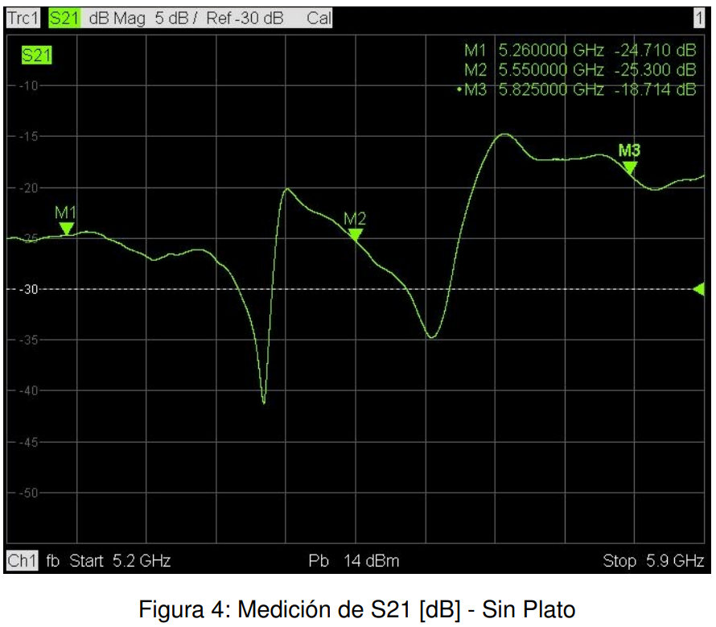
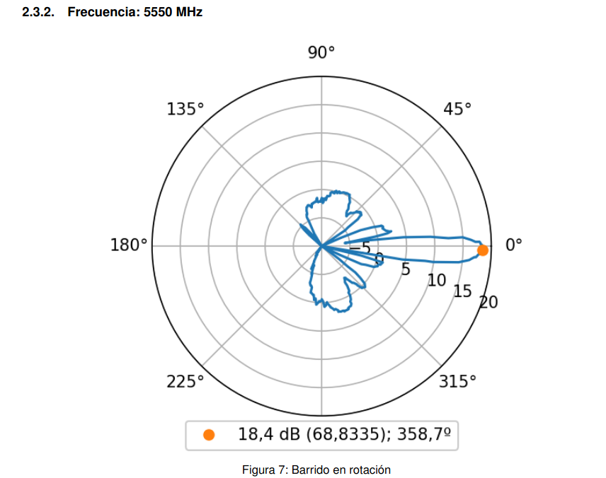
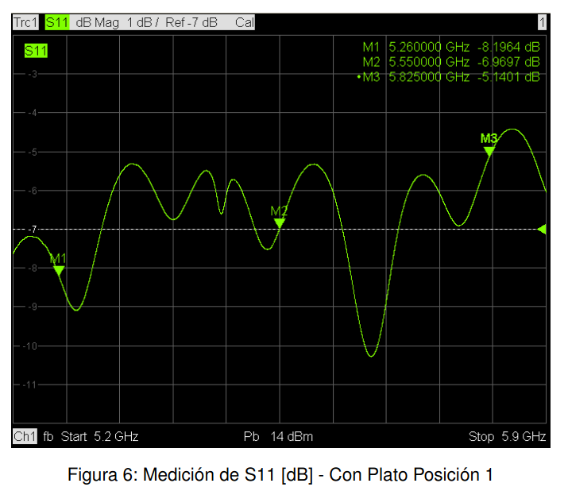
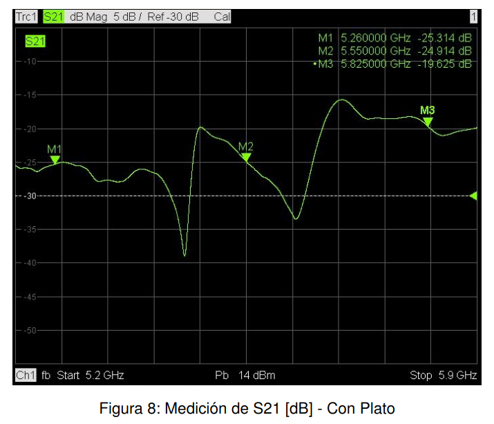
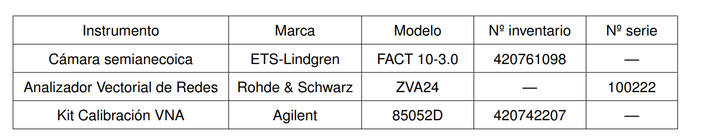
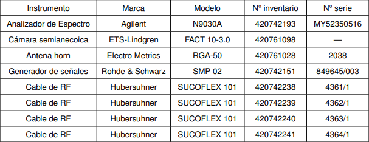

<!--
SPDX-FileCopyrightText: 2023 Tecnología de Raíz <tecnologiaderaiz@disroot.org>

SPDX-License-Identifier: CC-BY-NC-4.0
-->

# Caracterización

Luego de haber finalizado la etapa de prototipado, como estaba previsto enviamos uno de nuestros modelos al [INTI](https://www.argentina.gob.ar/inti) (Instituto Nacional de Tecnología Industrial) para que realicen una caracterización de nuestra antena sectorial y también de la misma convertida en direccional mediante sus accesorios.

Compartimos los datos más relevantes del informe entregado por el departamento de comunicaciones del INTI.

Estas imágenes fueron tomadas en una cámara semi-anecóica, que permite realizar pruebas sin la interferencia de ondas acústicas o electromagnéticas.

A través de este ensayo obtuvimos información que nos permite conocer con precisión las características de la antena.

Para ambos modos de la antena (sectorial y direccional) solicitamos la Medición del lóbulo de radiación en dos polarizaciones en 3 puntos específicos de frecuencia.

Estos fueron algunos de los resultados de las mediciones obtenidas en las pruebas.

### Lóbulo de radiación de antena sectorial

### Parámetro s11 antena sectorial

### Parámetro s21 antena direccional

### Lóbulo de radiación de antena direccional

### Parámetro s11 antena direccional

### Parámetro s21 antena direccional

### Compartimos la tabla de instrumentos utilizados para las pruebas.
Instrumental utilizado en la medición de los parámetros s11 y s21

Instrumental utilizado para hacer los diagramas de radiación

Informe completo en este [enlace](https://github.com/TecnologiadeRaiz/LoPALiR/blob/main/INFORME%20Waveguide%20INTI.pdf)
