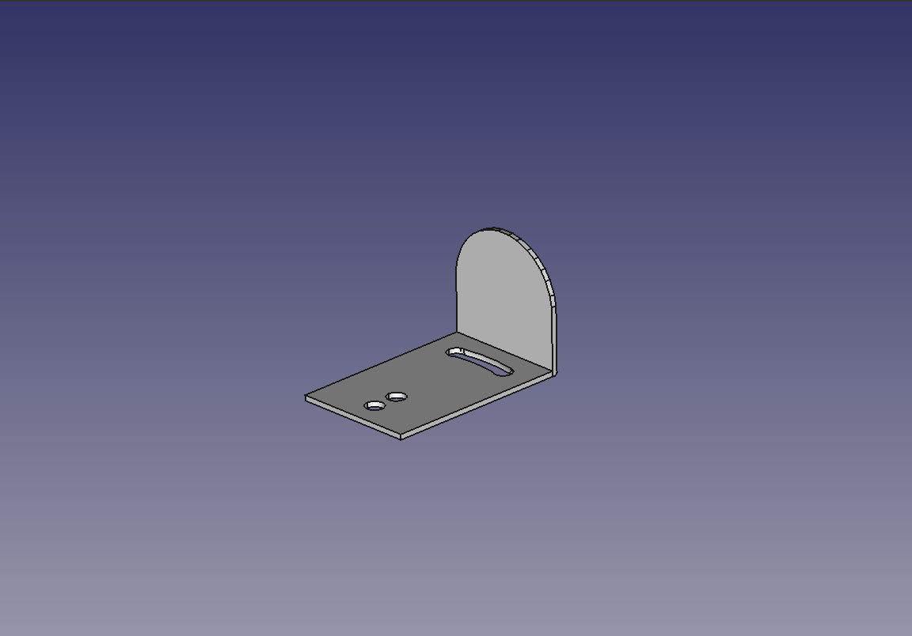
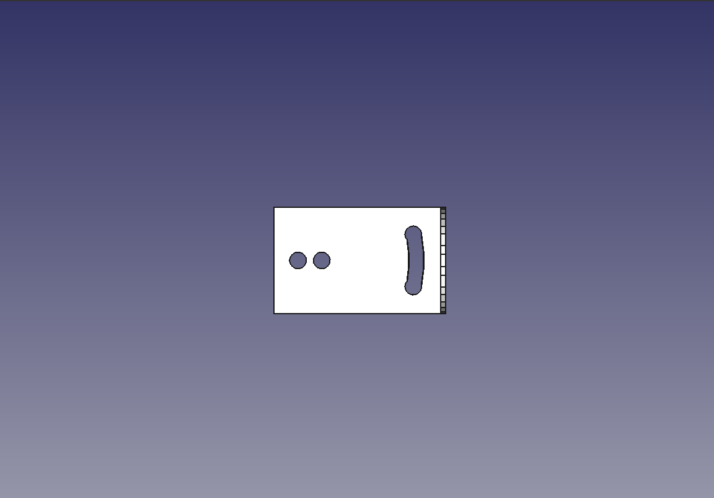
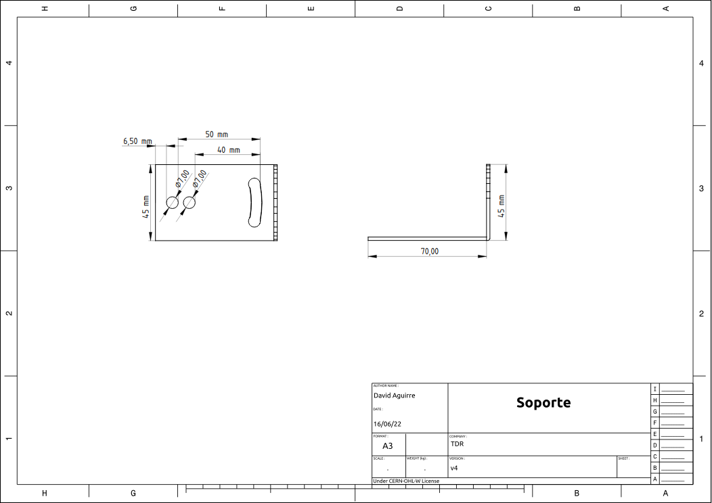

<!--
SPDX-FileCopyrightText: 2023 Tecnología de Raíz <tecnologiaderaiz@disroot.org>

SPDX-License-Identifier: CC-BY-NC-4.0
-->

# Diseño de soporte

## Desarrollo del diseño del soporte

En la búsqueda para obtener un diseño de soporte, tuvimos en cuenta:

* Que sea liviano.
* La menor cantidad de material posible.
* Que tenga la versatilidad de poder adaptarse a caños más pequeños o más grandes.
* Que el material utilizado sea duradero y compatible con el material de la antena.
* Que sea fácil de reproducir.

___

This project was funded through the <a href="https://nlnet.nl/useroperated/">User-Operated Internet</a> fund, a fund established by <a href="https://nlnet.nl">NLnet</a> made possible by financial support from the <a href="https://pkt.cash" rel="nofollow">PKT Community</a> <a href="https://pkt.cash/network-steward" rel="nofollow">The Network Steward</a> and stichting <a href="https://technologycommons.org">Technology Commons Trust</a> 

En cooperacion con <a href="https://altermundi.net/">AlterMundi.</a>

