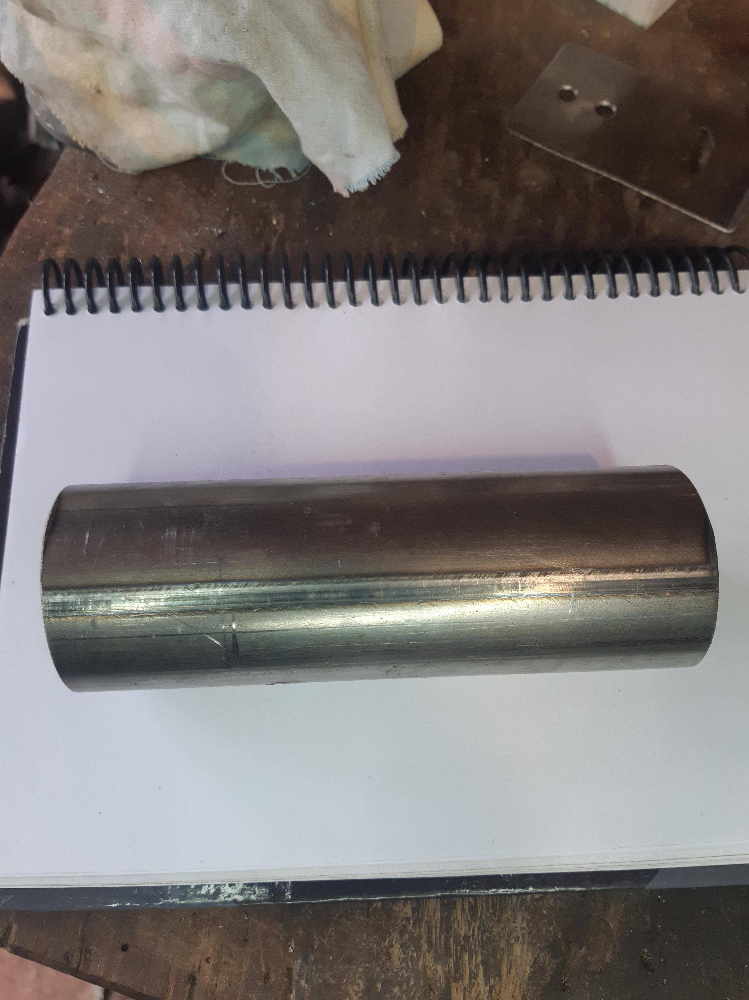
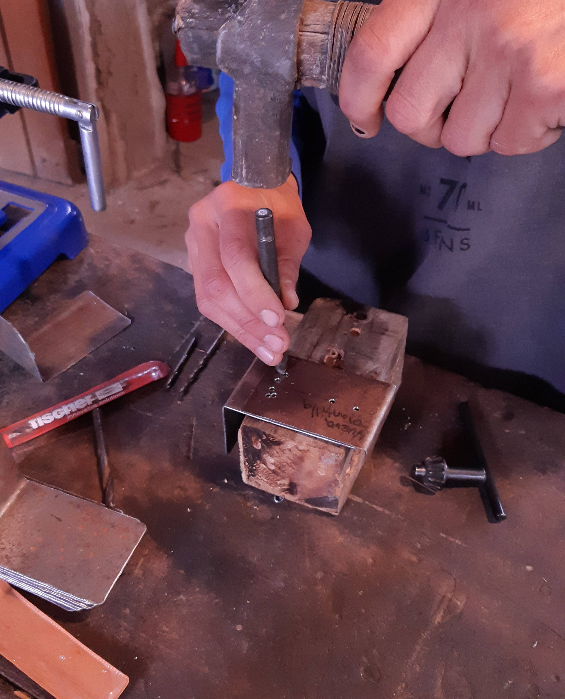
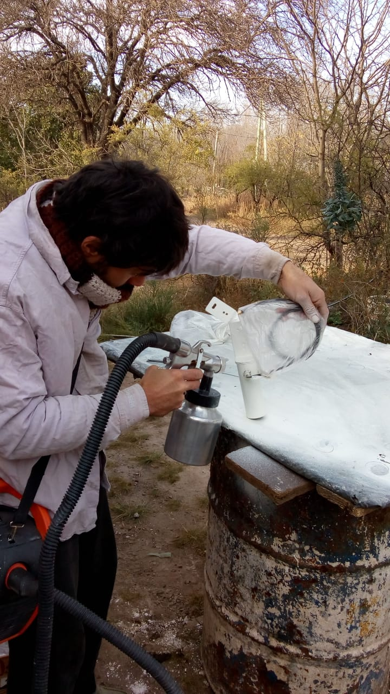
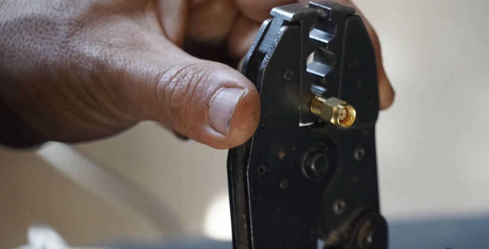
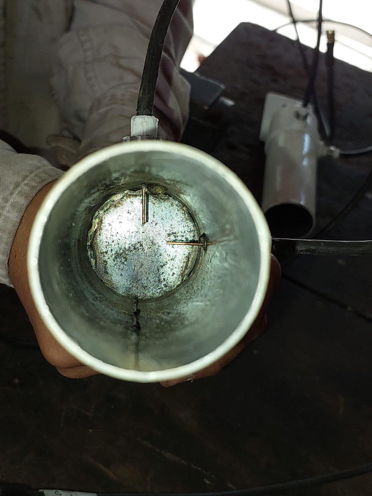

<!--
SPDX-FileCopyrightText: 2023 Tecnología de Raíz <tecnologiaderaiz@disroot.org>

SPDX-License-Identifier: CC-BY-NC-4.0
-->

# Guía de construcción
[TOC]

## Desarrollo de pasos para hacer una antena guía de ondas
<h2>
    <u>
        Elementos de protección personal:
    </u>
</h2>

<ul> 
    <li>
        Protectores auditivos
    </li>
    <li>
        Guantes
    </li>
    <li>
        Lentes
    </li>
    <li>
        Mascarillas
    </li>
    <li>
        Ropa de trabajo
    </li>
</ul>

<h2>
Lista de Materiales:
</h2>
- 130mm de Caño 44,5mm de diámetro *Guía de ondas*
- Rectángulo de 48mm x 70mm de Chapa N°18 *Soporte*
- 2 metros cable coaxil RF 50ohms (LMR200 - UHF [95/30](http://www.indeca.com.ar/productos/coaxiales-flexibles-de-50-y-75-ohms/23-uhf-95/30))
- 2 conectores RP-SMA-Male
- Termocontraíble 12mm
- Filamento PETG para impresión 3D
- Pintura anticorrosión
- 

<h2>
Lista de Herramientas:
</h2>
- Amoladora
- Morza
- Soldadora por arco eléctrico
- Soldador de inducción (estaño)
- Crimpeadora SMA
- Pelacables para coaxil
- Calibre
- Taladro y mechas 3mm, 7mm
- Equipo de pintura

<h2>
    Perforado y estañado de la guía de ondas
</h2>

<h4>
    <u>
        Espacio de trabajo:
    </u>
</h4>

    Para esta tarea, utilizamos la mesa de trabajo central, con el taladro de banco.

<h4>
    <u>
      Para este proceso necesitamos: 
    </u>
</h4>

<ul>
    <li>
        Taladro de banco
    </li>
    <li>
        Soldador de inducción
    </li>
    <li>
        Estaño
    </li>
</ul>

<h4>
    <u>
        ¿Cómo se hace?
    </u>
</h4>

    Con el caño de 44,5mm de diámetro y 130mm de largo procedemos a preparar el banco de trabajo para perforar la guia de ondas.

Con la ayuda del <a href="https://github.com/TecnologiadeRaiz/LoPALiR/blob/main/PLANOS/MOLDE%20DE%20PERFORACION%20-%20V2.svg">molde de perforacion</a>. 

 

Una vez perforado el caño estañamos alrededor de los orificios

    <mark>En caso de no contar con estas     herramientas, se puede realizar el procedimiento con otras más básicas. Para saber cómo, visitá el siguiente
<a 
href="https://github.com/TecnologiadeRaiz/LoPALiR/blob/main/perforado%20y%20estañado.pdf">enlace  </a>
    </mark>
    

<h4>
    <u>
        Advertencias:
    </u>
</h4>

    

    Es importante que los orificios de la guia de ondas esten alineados con los del soporte, ya que esto nos va a afectar a la hora de alinear la antena.

<h2>
    Marcar soportes
</h2>

<h4>
    <u>
        Espacio de trabajo:
    </u>
</h4>

    Para este proceso utilizamos una mesa y un taco de madera que nos ayuda a realizar el marcado con una plantilla hecha a medida para luego perforar los <a href="https://github.com/TecnologiadeRaiz/LoPALiR/blob/main/Plano%20Soporte-v3.svg">Soportes</a>.

<h4>
    <u>
        Para este proceso necesitamos:    
    </u>
</h4>

<ul>
    <li>
        Mesa firme
    </li>
    <li>
        Taco de madera
    </li>
    <li>
        Plantilla de perforacion
    </li>
    <li>
        Plancha de metal de 2mm de grosor de 50mm x 80mm con un pliegue a 90º de 50mm x 50mm,
    </li>
    <li>
        Punto de marcar
    </li>
    <li>
        Martillo 
    </li>
</ul>

<h4>
    <u>
        ¿Cómo se hace?    
    </u>
</h4>

Utilizamos la mesa de trabajo con un taco de madera que sostiene la plancha de metal para marcarla, apoyando la plantilla para hacer las perforaciones sobre ella.

    Con la ayuda de la plantilla procedemos a marcar la plancha con un punto de marcar y martillo.

    De no contar con recursos para crear esa plantilla, Visitá el siguiente 
<a 
href="https://github.com/TecnologiadeRaiz/LoPALiR/blob/main/Marcar%20soportes.pdf">enlace </a>   

<h4>
    <u>
        Recomendaciones:
    </u>
</h4>

    Es importante que la plantilla esté alineada con el soporte, para luego no tener problemas a la hora de alinear las antenas.

<h2>
    Perforar soportes
</h2>

<h4>
    <u>
        Espacio de trabajo:
    </u>
</h4>

    Utilizamos la mesa de trabajo central con el taladro de banco, y la plantilla diseñada para tal fin.

<h4>
    <u>
        Para este proceso necesitamos:
    </u>
</h4>

<ul>
    <li>
        Mecha 6mm
    </li>
    <li>
        Lima redonda y plana (para eliminar rebarbas)
    </li>
    <li>
        Taladro de banco
    </li>
    <li>
        Morza
    </li>
    
</ul>

<h4>
    <u>
        ¿Cómo se hace?
    </u>
</h4>

    Con las planchas de metal marcadas, procedemos a perforarlas con el taladro de banco.
    Una vez realizadas las perforaciones, limamos las rebarbas.

 

<h4>
    <u>
        Recomendaciones y advertencias: 
    </u>
</h4> 
 

    Es recomendable utilizar un taco de madera que la morza del taladro de banco pueda sujetar y permita apoyar el soporte encima para perforar sobre él.
    
Tambien es recomendable no demorar demasiado realizando la perforacion para no estropear la mecha, ya que esta se calienta mucho por la friccion. Además recomendamos utilizar baja velocidad para perforar metales.
    
<mark>La perforación de los soportes se puede realizar, en caso de no contar con taladro de banco, con taladro de mano.
</mark>    

<h2>
    Recortar bordes para darle forma circular al soporte
</h2>

<h4>
    <u>
        Espacio de trabajo:
    </u>
</h4>

    Utilizamos la mesa central del taller.

<h4>
    <u>
      Para este proceso necesitamos: 
    </u>
</h4>

<ul>
    <li>
        Tijera cortachapa
    </li>
    <li>
        Lima
    </li>
</ul>

<h4>
    <u>
        ¿Cómo se hace?
    </u>
</h4>

    Se utiliza el caño de la guía de ondas como plantilla para marcar los soportes.
    Luego con la tijera de cortar chapa, siguiendo las marcas, se le da forma redondeada.

<h4>
    <u>
        Recomendaciones:
    </u>
</h4>

>! Recordemos siempre utilizar elementos de seguridad personal, en este caso guantes.

<h2>
    Soldar soportes
</h2>

<h4>
    <u>
        Espacio de trabajo:
    </u>
</h4>

    Utilizamos la mesa de trabajo, con una chapa que resguarde la mesa de las chispas que caen durante la soldadura.

<h4>
    <u>
      Para este proceso necesitamos: 
    </u>
</h4>

<ul>
    <li>
        Chapa
    </li>
    <li>
        Soldador inverter
    </li>
    <li>
        Electrodos E-6013 (o compatible)
    </li>
    <li>
        Morza
    </li>
    <li>
        Caño y soporte
    </li>
    <li>
        Guantes de soldar o de cuero
    </li>
    <li>
        Máscara protectora
    </li>
</ul>

<h4>
    <u>
        ¿Cómo se hace?
    </u>
</h4>

    Con el soporte agarrado a la morza por su lado perforado, colocamos la guia de ondas con las perforaciones hacia abajo y una de ellas orientada hacia el lado redondeado del soporte.  

 <h4>
    <u>
        Recomendaciones:
    </u>
</h4>

>! Es muy importante que se utilice protección en la vista, las máscaras que se utilicen deben ser las apropiadas para soldador eléctrico.
    

<h2>
    Amolar y masillar
</h2>

<h4>
    <u>
        Espacio de trabajo:
    </u>
</h4>

    Utilizamos la mesa central del taller con la morza colocada.

<h4>
    <u>
      Para este proceso necesitamos: 
    </u>
</h4>

<ul>
    <li>
        Morza
    </li>
    <li>
        Amoladora
    </li>
    <li>
        Disco de amolar
    </li>
    <li>
        Guía de ondas con soportes soldados
    </li>
</ul>

<h4>
    <u>
        ¿Cómo se hace?
    </u>
</h4>

    Sujetando la guia de ondas con la morza firmemente, eliminamos el excedente de soldadura del soporte y la guia de ondas.

<h4>
    <u>
        Advertencias:
    </u>
</h4>

    
>! Utilizar elementos de protección personal, en este caso lentes, guantes, protección auditiva y ropa de trabajo que cubra todo el cuerpo, para que la viruta de metal no nos dañe. Asimismo, trabajar con la ventilación correspondiente

<h2>
    Pintura antenas
</h2>

<h4>
    <u>
        Espacio de trabajo:
    </u>
</h4>

    La máquina de pintar se utiliza en cabina de pintado o en exterior, ya que el espacio de trabajo dentro del taller es muy reducido, y la máquina pulveriza gran cantidad de pintura.

<h4>
    <u>
      Para este proceso necesitamos: 
    </u>
</h4>

<ul>
    <li>
        Pintura sintética de alta resistencia.
    </li>
    <li>
        Máquina para pintar.
    </li>
    <li>
        Diluyente.
    </li>
</ul>

<h4>
    <u>
        ¿Cómo se hace?
    </u>
</h4>

   Para utilizar la maquina para pintar, primero se debe diluir la pintura de manera que quede lo suficientemente liquida para poder ser pulverizada por la máquina.
    Para el secado, utilizamos un dispositivo colgante donde pueden permanecer durante el tiempo necesario, sin obstaculizar el trabajo en el resto del taller, hasta finalizar su proceso de secado.

    
   En caso de no contar con máquina para pintar, este procedimiento se puede realizar con pincel 
    

<h2>
    Armado de cables pigtail
</h2>

<h4>
    <u>
        Espacio de trabajo:
    </u>
</h4>

    Esta parte de la producción se realiza en una mesa libre de limaduras o virutas de metal.

    Colocamos los conectores SMA RP male

    Para mostrar como es el proceso, compartimos estos videos explicativos:

<ul>
    <li>
        <a 
href="https://player.vimeo.com/video/780569067?h=7d256afc33">Ensamblado parte 1</a>
    </li>
    <li>
        <a href="https://player.vimeo.com/video/780568264?h=076a3a0531">Ensamblado parte 2</a>
    </li>
</ul>
    
     
    
    
   
    

    Para finalizar el proceso, se crimpean y se les coloca termocontraible 

    En el otro extremo del cable, pelamos la vaina hasta obtener la espiga que iluminará la guía de ondas.
	Recomendamos una espiga de 11.7mm de longitud.

<h2>
    Soldar cables al caño
</h2>

 <h4>
    <u>
        Espacio de trabajo:
    </u>
</h4>

    Este proceso se puede realizar en la mesa de trabajo auxiliar, donde tenemos instalado un dispositivo con ranuras para sostener los cables.

<h4>
    <u>
      Para este proceso necesitamos: 
    </u>
</h4>

<ul>
    <li>
        Estaño
    </li>
    <li>
        Soldador vesubio
    </li>
    <li>
        Segmento de 5mm de caño de aluminio de 8mm (3/8")
    </li>
    <li>
        Cable pigtail x2
    </li>
</ul>

<h4>
    <u>
        ¿Cómo se hace?
    </u>
</h4>

    Estañamos las perforaciones previamente cepilladas, luego tomamos el cable  pigtail, lo colocamos en la perforacion y soldamos la malla al caño (guia de ondas).

 

    <mark>En caso de no contar con soldador vesubio, se puede realizar este trabajo con soldador zinguero.</mark>
    

    

<h4>
    <u>
        Recomendaciones o advertencias:
    </u>
</h4>

    Debemos asegurarnos de que el soldador este bien caliente y limpio, para reducir al mínimo el tiempo de contacto y así no quemar la vaina del cable.

<h2>
    Impresión de anillos portachains
</h2>

<h4>
    <u>
        Espacio de trabajo:
    </u>
</h4>

    Utilizamos un mueble donde esta posicionada la impresora 3D, resguardada de la hostilidad del taller.

<h4>
    <u>
        Para este trabajo necesitamos:    
    </u>
</h4>

<ul>
    <li>
        Diseños hechos en Freecad
    </li>
    <li>
        Impresora 3D
    </li>
    <li>
        Filamento Petg
    </li>
</ul>

<h4>
    <u>
        ¿Cómo se hace?    
    </u>
</h4>

    Laminamos los diseños (.stl) hechos en Freecad para obtenerlos en formato .gcode en este caso, los almacenamos en una tarjeta de memoria que insertamos en la impresora 3D para imprimirlos.

<h2>
    Colocar anillos portachains
</h2>

<h4>
    <u>
        Espacio de trabajo:
    </u>
</h4>

    
    Utilizamos la mesa auxiliar para poner los portachain.

<h4>
    <u>
       Para este proceso necesitamos:
    </u>
</h4>

<ul>
    <li>
        Anillos portachain    
    </li>
    <li>
        Antena con cables soldados
    </li>
    <li>
        Caño de aluminio de 3/8"
    </li>
</ul>

<h4>
    <u>
        ¿Cómo se hace?
    </u>
</h4>
 

    Se introduce el anillo más grande a través de la guía de ondas, hasta llegar al lugar donde se encuentra el cable.
 Luego se acopla el portachain trasero, utilizando un segmento de 5mm de caño de aluminio de 3/8", pasandolo a través del cable y llevandolo hasta los dos portachains juntos, y crimpeandolo para sujetar con firmeza los cables.
 

<h2>
    Testeo
</h2>

<h4>
    <u>
        Espacio de trabajo
    </u>
</h4>

    Este trabajo se puede realizar en el dispositivo creado para sostener los cables.

<h4>
    <u>
        Para este proceso necesitamos.
    </u>
</h4>

<ul>
    <li>
        <a href="https://github.com/TecnologiadeRaiz/LoPALiR/blob/main/RC%20Antenna%20SWR%20Meter.pdf">RC Antena SWR Meter</a>.
    </li>
</ul>

<h4>
    <u>
        ¿Cómo se hace?
    </u>
</h4>

    En primer lugar se realiza una inspección ocular para acomodar a 90 grados las dos espigas.
    Una vez realizado ese procedimiento, se conecta uno de los cables al medidor RC antenna meter y se miden  primero las ondas emitidas por ese chain, y luego las del otro.

<h2>
    Colocar tapas y terminacion
</h2>

<h3>
    <u>
        Para este proceso necesitamos
    </u>
</h3>

<ul>
    <li>
        Regaton o tapa de plático
    </li>
    <li>
        Guía de ondas ensamblada
    </li>
</ul>

    Para proteger los iluminadores, la guia de ondas se cierra con una tapa de plástico y sellador de silicona para evitar filtraciones.

<h2>
Antena terminada    
</h2>

<h2>
>!! TdR no se hace responsable de los posibles daños causados por la realización de los procedimientos propuestos en este material informativo.
</h2>

		
	
	

