<!--
SPDX-FileCopyrightText: 2023 Tecnología de Raíz <tecnologiaderaiz@disroot.org>

SPDX-License-Identifier: CC-BY-NC-4.0
-->

# Prototipo de guía de ondas

En este material mostraremos los diferentes modelos de antenas que fuimos desarrollando hasta llegar al prototipo actual.
Describiremos algunas caracteristicas de cada antena, y un grafico de sus testeos realizado con un <a href="https://github.com/TecnologiadeRaiz/LoPALiR/tree/main/Mediciones">programa</a> diseñado para tal fin en una distancia de 1,1 km.

Nuestro escenario de pruebas se encuentra entre un pino muy alto en la localidad de Casa Grande y la parte alta de una casa en la localidad de Molinari.

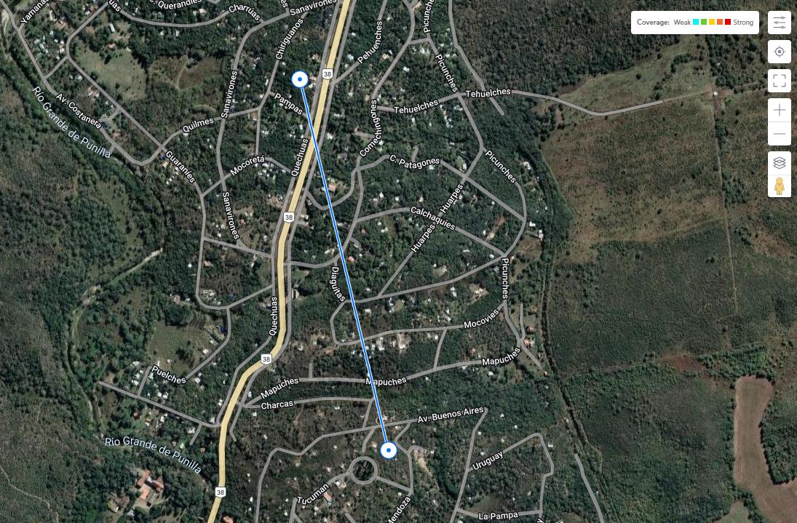 
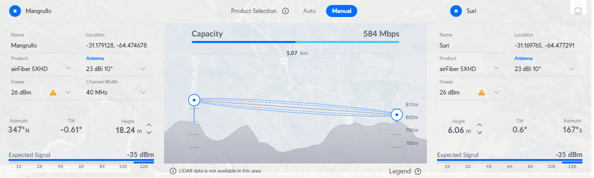

<h2>
    <u>
        Prototipo 1
    </u>
</h2>

<h3>
    Version 1:
</h3>

En la busqueda de una antena tipo guía de ondas, desarrollamos este prototipo; uno de los aspectos en los que trabajamos es la creación de un soporte para la antena y el montaje de los cable sobre la guía.

<b>
   Un primer intento de soporte fue este:
</b>

 
 

<b>
   Aprovechando un soporte existente, soldamos la guía de ondas al mismo.
</b>

   En este caso utilizamos un caño de 38mm de diámetro.

 

<ul>
    <li>
        Ventajas:
    </li>
</ul> 

La forma de sostener los cables en este prototipo era realizar una ranura en la guía de ondas y con ese material, sumando un caño de cobre, sostener el cable. Lo cual simplifica el montaje.

    
<ul>
    <li>
        Inconvenientes:
    </li>
</ul>

Por las caracteristicas del material, su peso y su forma, encontramos poco funcional este diseño de soporte; esto nos llevo a repensar como usar el material y la forma del soporte.

La ranura genera pérdida de radiación.

El diámetro del caño "corta" el paso de las frecuencias más bajas.

<h3>
    Versión 2:
</h3>

<b>
   Probamos modificar la longitud de la guía de ondas, con un caño más largo.
</b>

   Modificamos en esta versión la forma de sujetar los cables, soldando a la guía de ondas un caño de cobre, crimpeandolo, y sellandolo con termocontraible.

<ul>
    <li>
        Ventajas:
	</li>
</ul>

   Robustez en el agarre
precisión en la posición final de los iluminadores.

<ul>
    <li>
        Inconvenientes:
    </li>
</ul>

   Utilizamos una soldadora autógena (oxígeno y acetileno) lo que aumenta la complejidad del taller y la dificultad para la soldadura.

También se agrega la posibilidad de generar "tensiones de juntura" entre los materiales, que podrían afectar el desempeño de la antena.
    

    

<h2>
    <u>
       Prototipo 2 Cónica:
    </u>
</h2>

<h3>
    Versión 1:
</h3>

    <b>
        En esta versión, volvimos a sujetar los cables como en la versión anterior, soldando a la guía de ondas un caño de cobre, crimpeandolo, y sellandolo con termocontraible.
    </b>
   

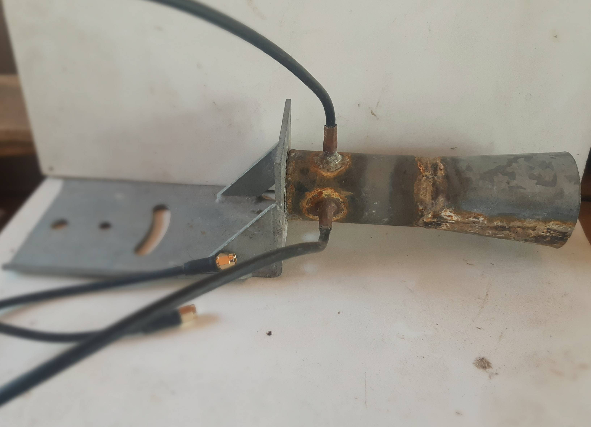

<ul>
    <li>
        Ventajas:
    </li>
</ul>

    Notamos que agregarle el suplemento cónico mejora su rendimiento.

<ul>
    <li>
        Inconvenientes:
    </li>
</ul>

    Para este prototipo, utilizamos el soporte grande, que es muy pesado. Lo consideramos poco funcional.

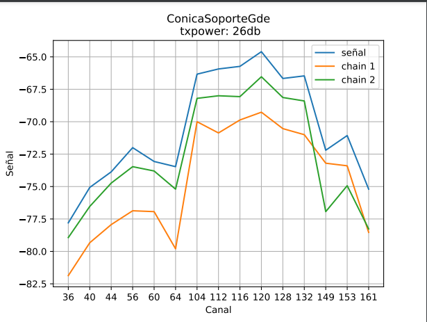

 

<h3>
    Versión 2:
</h3>

   <b>
       En este prototipo, acortamos el largo del caño, de 42 mm de diámetro interno, sumandole una terminación cónica realizada con chapa y soldada.

</b>
    
Para sostener los cables, diseñamos un agarre tipo "puente" con chapa soldado a la guía de ondas. 

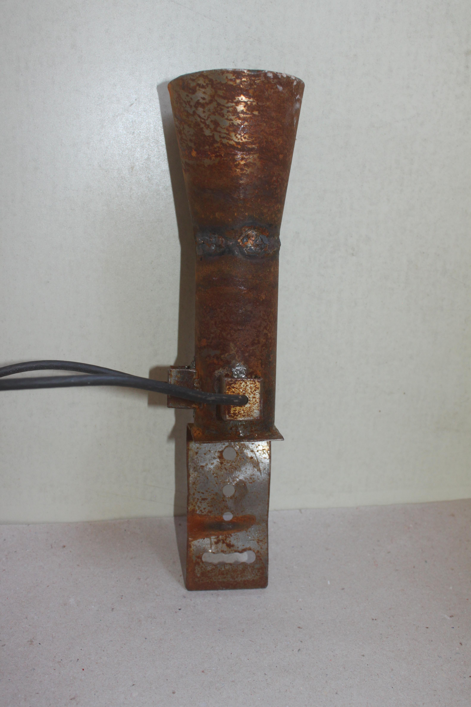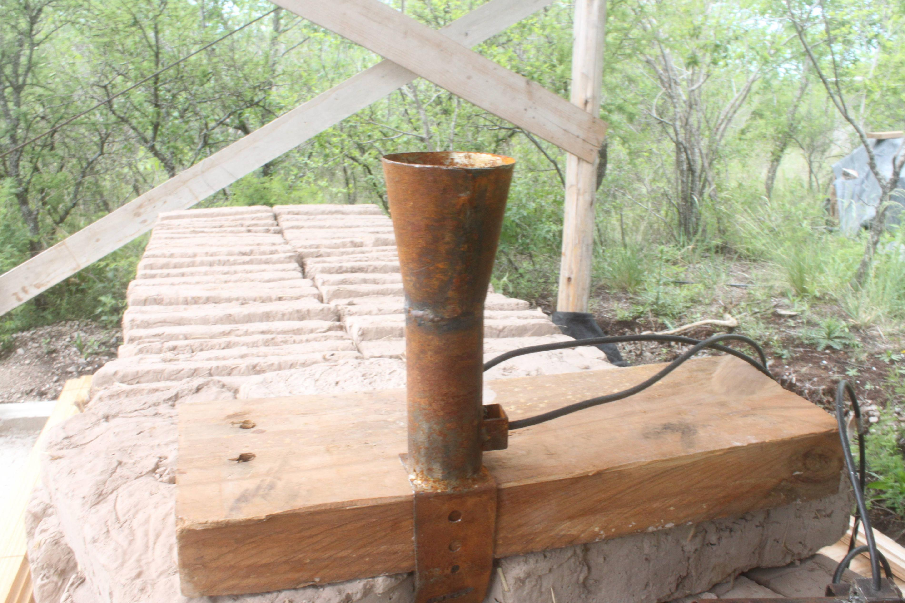

<ul>
    <li>
        Ventajas:
    </li>
</ul> 

   En relación al soporte al ser más liviano y compacto permite trasladarlo con más facilidad, siendo además más económico por tener menos material.
    
A esa versión de soporte, le hicimos perforaciones para aprovechar las medidas de las "u roscadas" que se consiguen con facilidad en ferreterías creando un soporte adaptable a dos medidas de caño. Esto le aporta accesibilidad al producto.
    

   Con este diseño, estamos utilizando el soporte como tapa de la guía de ondas.El primer prototipo de soporte soldado como tapa de la antena, tenía 10 cm de largo. 

Luego elegimos dejar lugar sólo para dos medidas de "u roscada", dando así la posibilidad de completar el soporte de acuerdo al caño donde se agarre.
    

<ul>
    <li>
        Inconvenientes:
    </li>
</ul> 

   En este prototipo, encontramos muchas dificultades para soldar los cables a la guía de ondas. Puede observarse el la gráfica de mediciones como el chain 2 (en verde) con fallas en la soldadura de la malla, tiene menor ganancia.

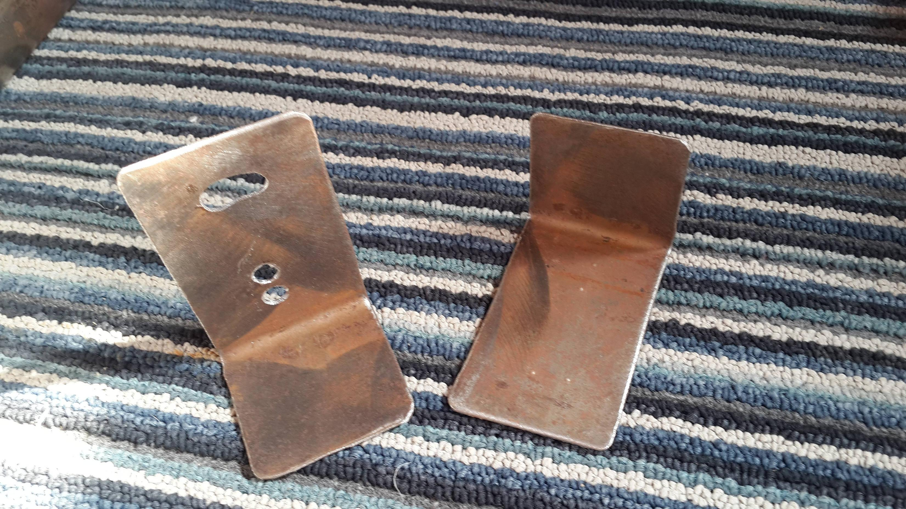
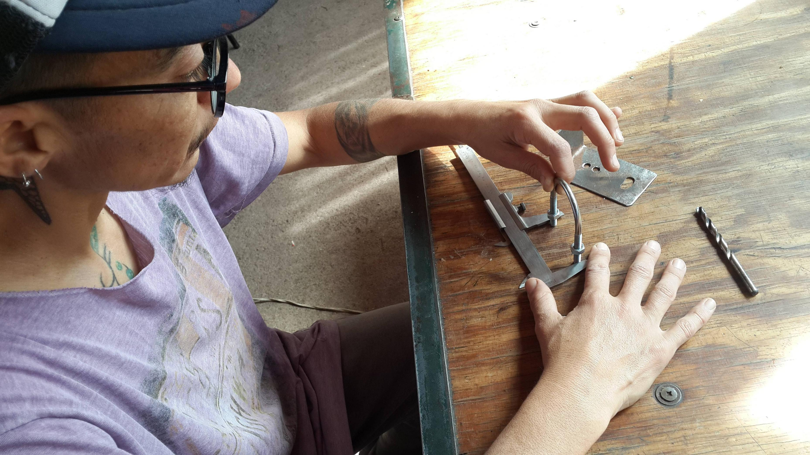

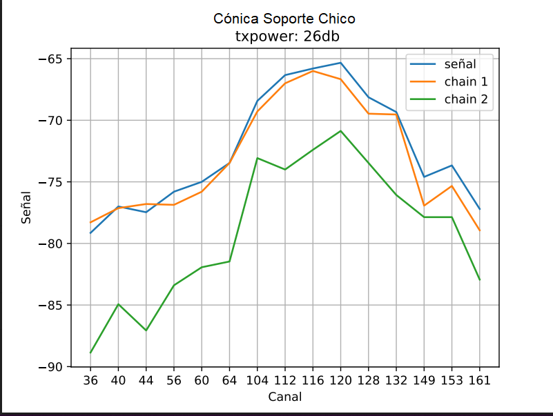

<h2>
    <u>
       Prototipo 3
    </u>
</h2>

    <b>
        En esta versión, volvimos a probar sujetar los cables con el modelo "puente" de chapa doblada, en un prototipo de guía de ondas más corto, con diámetro interno de 44mm, sin cono.
    </b>
   

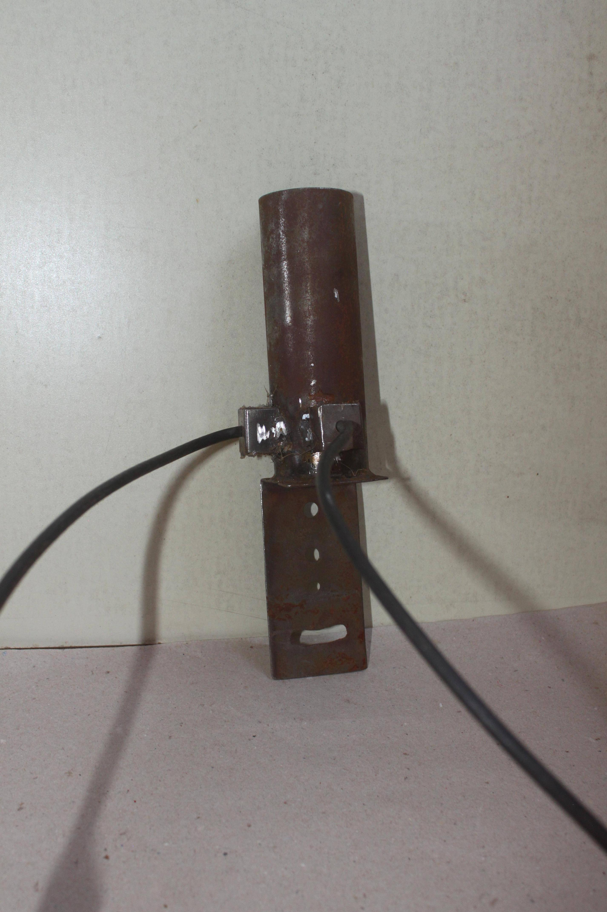
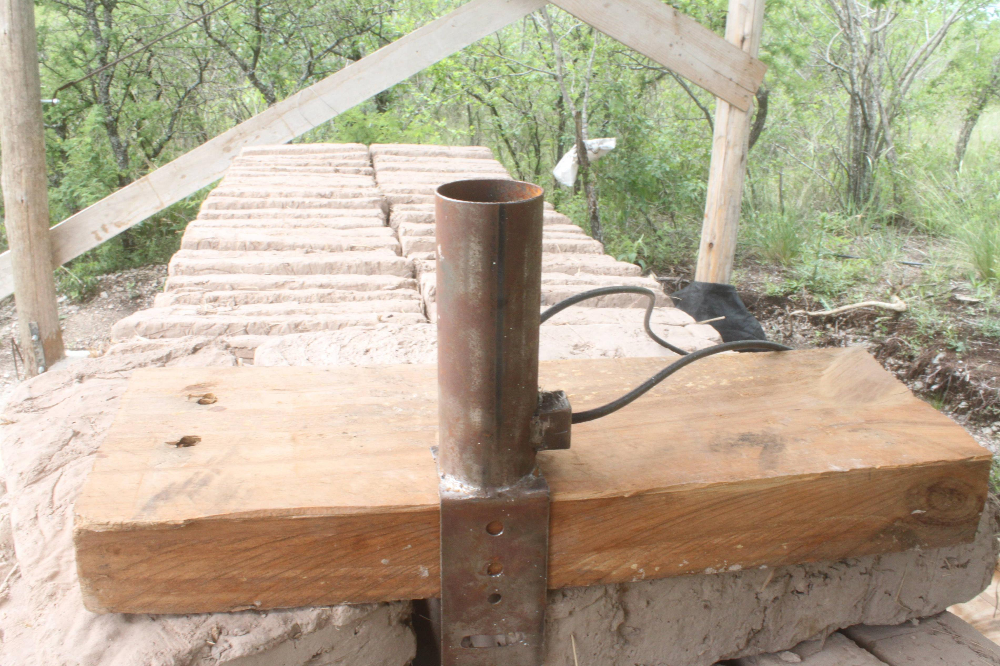

   A pesar de obtener muy buenos resultados en el rendimiento de la antena, seguimos en la búsqueda de una forma de sujetar los cables más sencilla, conservando la longitud de la guía de ondas en el siguiente prototipo.

    
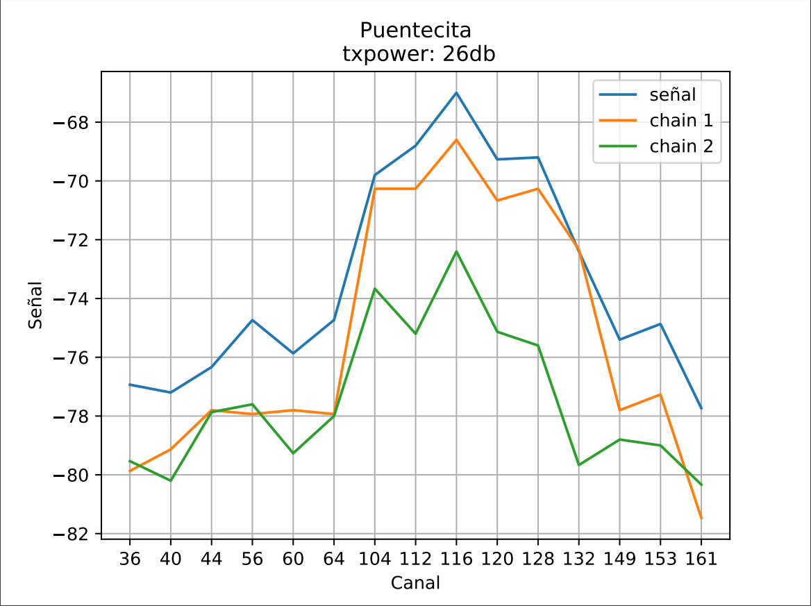

<ul>
    <li>
        Ventajas:
    </li>
</ul>

    Obtuvimos buenos resultados en el rendimiento.

<ul>
    <li>
        Inconvenientes:
    </li>
</ul>

   Dificultad para soldar la malla de los cables al caño 

<h2>
    <u>
       Prototipo 4 Resina
    </u>
</h2>

    <b>
        En este prototipo, probamos sujetar los cables con una manguera de ø=1/8 de pulgada , transparente, rellena con resina epoxi. 
    </b>
 

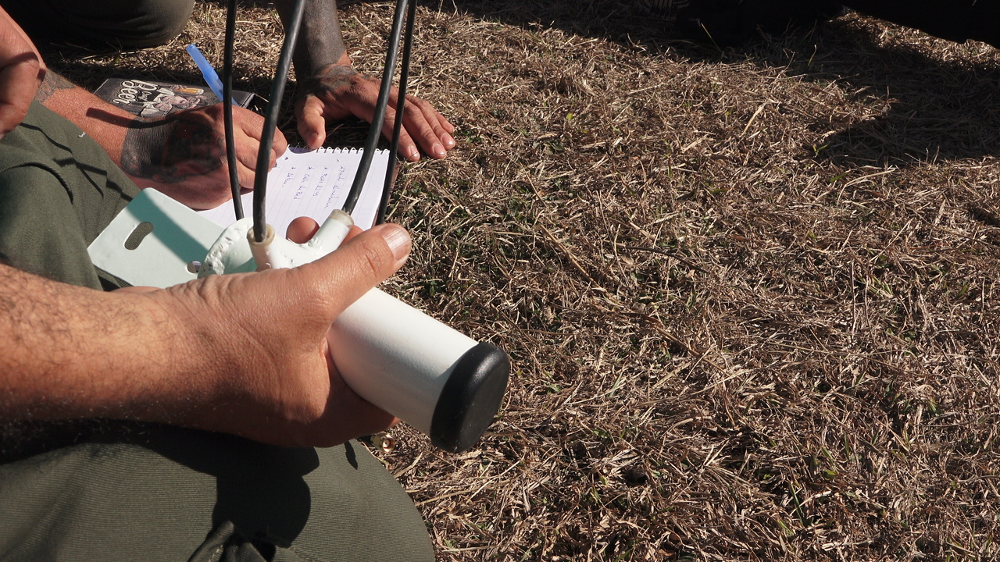

<ul>
    <li>
        Ventajas:
    </li>
</ul>

    Los resultados en el rendimiento de la antena fueron buenos.
    

<ul>
    <li>
        Inconvenientes:
    </li>
</ul>

   Fragilidad en la unión de los cables con la guía de ondas. Algunas pruebas se despegaron, quedando inutilizables.
    
Dificultad para remover los restos de resina en caso de necesitar reparación.
    
Toxicidad del proceso y los residuos resultantes.

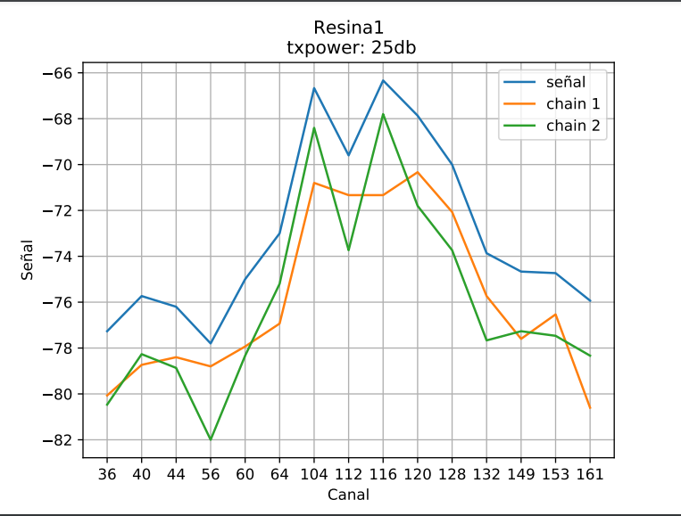

<h2>
    <u>
       Prototipo 5 Acople de partes plasticas
    </u>
</h2>

    <b>
        A través del <a href="https://github.com/TecnologiadeRaiz/LoPALiR/tree/main/Partes%20plasticas">diseño</a> en <a href="https://www.freecadweb.org/">Freecad</a>, logramos imprimir en 3d partes plásticas que permiten, acoplándose, sostener los cables de forma eficiente, rápida y duradera.
    </b>
    

    

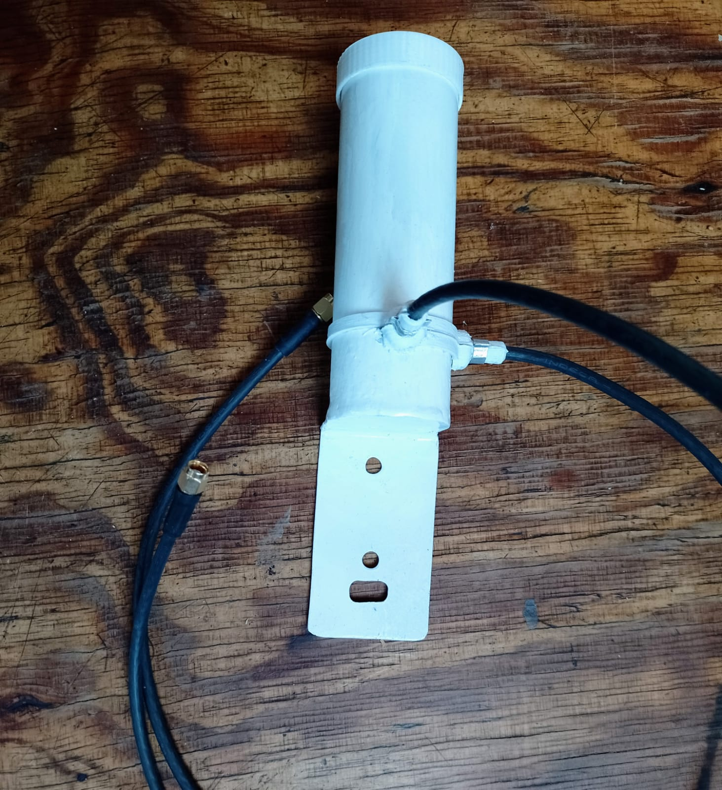
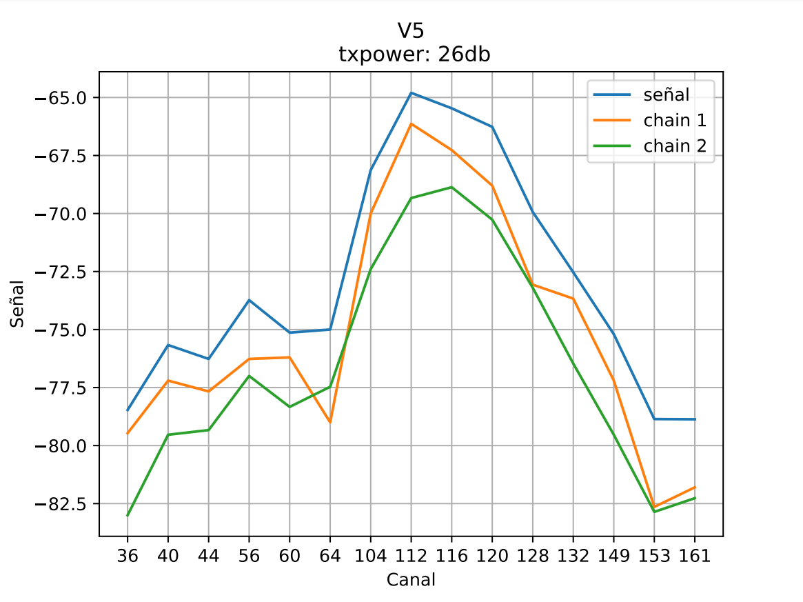

<ul>
    <li>
        Ventajas:
    </li>
</ul>

   Simpleza de montaje.
    
Robustez y precisión en el agarre de los cables.

<ul>
    <li>
        Inconvenientes:
    </li>
</ul>

   Acceso a impresiones 3D.
    
Necesidad de desarrollar impermeabilización en la unión de las partes plásticas.

