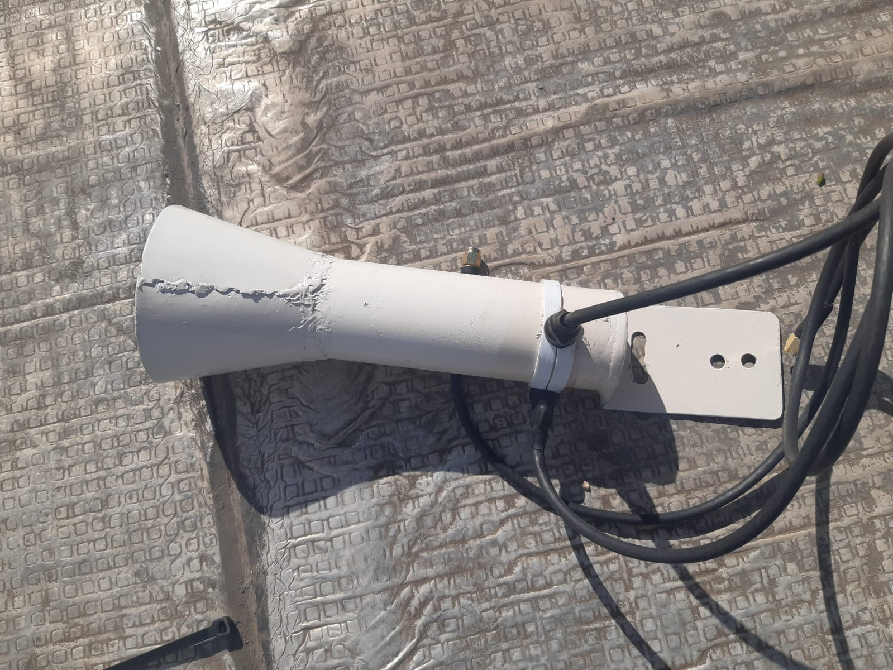
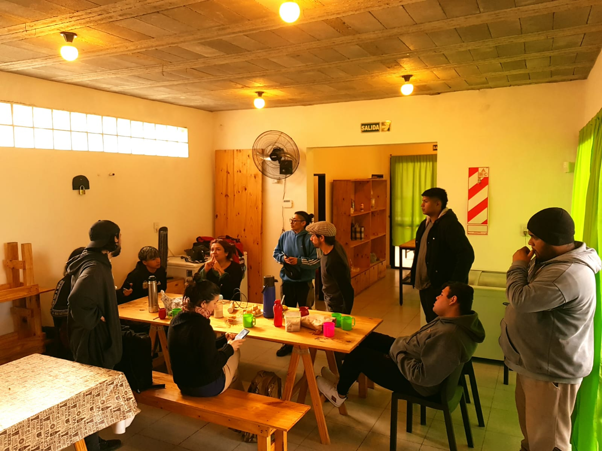

#Pruebas de campo

Despues de finalizar con el prototipado de la antena secorial y parabolica, decidimos experimentar haciendo un prototipo de nuestra version conica con partes plasticas.

Realizamos pruebas de campo en la red comunitaria vecina "Campo de la rivera", ubicada en la periferia de la capital de Córdoba, la misma cuenta con 5 nodos librerouters, distribuidos dentro de el barrio popular 

estos son los resultados que obtuvimos 