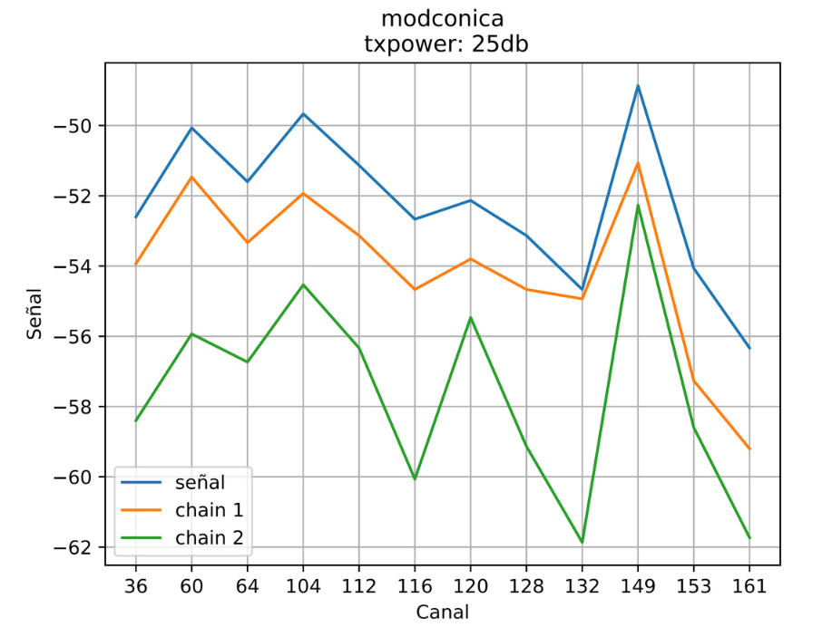

<!--
SPDX-FileCopyrightText: 2023 Tecnología de Raíz <tecnologiaderaiz@disroot.org>

SPDX-License-Identifier: CC-BY-NC-4.0
-->

# Pruebas de campo

## Intro

En este material vamos a comaprtir las experiencias en las que trabajamos en relación a las pruebas de campo de nuestras antenas, contando sobre los programas y organizaciones y referenciando a quienes intervinieron en estos procesos. 
Consideramos que estas experiencias son muy enriquecedoras para los grupos que formaron parte, ya que la articulación entre las organizaciones nos permite seguir creciendo y aprendiendo, a la vez que habilita a quienes lo requieran la posibilidad de desplegar, ampliar y construir insumos para las redes comunitarias.
Una de esas experiencias es el proyecto ANERA, en el que AlterMundi promovió la participación, capacitación y fortalecimiento de un programa nacional de subvenciones a redes cominitarias [Roberto Arias - ENACOM](https://altermundi.net/2022/11/03/ieee-reconocio-con-el-primer-premio-al-semillero-de-redes-comunitarias-para-postulantes-al-programa-roberto-arias/). En el desarrollo de este exitoso proyecto se realizaron diversas actividades, como por ejemplo un [encuentro presencial](https://elbrote.org/alegria-comunidad-y-redes-libre/) en el que [entregamos las antenas fabricadas en el taller de TdR a varias redes a lo largo del país.](https://www.instagram.com/reel/CkwruueuoDV/?igshid=MTc4MmM1YmI2Ng==)

Así también por ejemplo en India, donde gracias al programa ["Comunitty of Practice"](https://communitynetworks.group/c/cops/16) de la "Asociación para el Progreso de la Comunicaciones" y la participación de la comunidad de [Janastu](https://open.janastu.org/projects), sucedieron intercambios de prácticas y métodos de producción de antenas.

De manera similar, la comunidad de [Colnodo](https://colnodo.apc.org/es/experiencias/el-equipo-de-redes-comunitarias-de-colnodo-fabrica-prototipo-de-antena-para-conectar-territorios-en-colombia) en Colombia, adoptó nuestro diseño y método de fabricación, analizando sus primeros prototipos en laboratorios de la Universidad Departamental de Bogotá.

Posterior a esas experiencias y con el objetivo de realizar pruebas de campo de la versión cónica de nuestras antenas, organizamos una visita a Campo de la Rivera, barrio popular de la periferia de la capital de Córdoba, donde los vecinos y vecinas crearon una red comunitaria para resolver sus problemas de conectividad, principalmente relacionados con la falta de recursos para acceder a las costosas prestaciones de servicios de las empresas de telecomunicaciones.
Allí, quienes participan de la agrupación Encuentro de Organizaciones, instalaron 5 nodos LibreRouter con antenas construidas por TdR, que reemplazamos por antenas cónicas para realizar pruebas de campo. 
En esta parte del barrio, la red comunitaria y las antenas de TdR permiten tener conectividad a vecinos y vecinas, así como a un [espacio comunitario](https://www.facebook.com/asambleadecampodelaribera/) donde funciona un comedor, merendero y otras actividades que enriquecen el trabajo comunitario. 
Allí nos reunimos en el espacio del comedor comunitario, donde hicimos puesta en común de actividades y nos indicaron cómo es la red para dar comienzo a las pruebas. 
 

---
## Resultados de las pruebas.

### Primera prueba.

En primer lugar realizamos mediciones con las antenas que tenían instaladas en la red de Campo de la Rivera. Estas antenas, realizadas con el metodo de sujeción de cables de resina, dieron los siguientes resultados:

Aquí podemos observar cómo este prototipo no resuelve la necesidad, ya que los cables no quedan sujetos firmemente, lo que afecta negativamente al rendimiento de este prototipo; cómo resultado de este inconveniente se puede observar en la imagen donde el chain 2 tiene un nivel de señal menor que el chain 1.

Luego de terminar las pruebas con el prototipo con sujeción de resina, instalamos un prototipo version cónica que dio estos resultados:

En este grafico podemos observar que la señal de la antena en su chain 1 llega en los canales centrales a -54dB. Es importante tener en cuenta que, en los gráficos, la señal en dB se ve reflejada en sentido vertical y los canales utilizados en sentido horizontal. los diferentes niveles de señal no se ubican por igual en todos los gráficos expuestos, por lo que para realizar una comparación entre el rendimiento entre los diferentes prototipos, debemos siempre prestar atención a la referencia en dBs que contiene cada imagen. 

---
### Segunda prueba
 

Nuestra siguiente prueba de campo fue realizada en la red comunitaria que se encuentra en nuestro territorio. Aquí [MonteLibre](https://libregrande.online/) permite a 60 familias de dos pueblos lindantes entre sí el acceso a la comunicación.

Esta red, que ya contaba con antenas tipo guía de ondas construidas en el taller de TdR, nos permitió realizar pruebas de campo entre dos de sus nodos principales situados a una distancia de 1,2 km.

Inicialmente realizamos mediciones con las antenas versión 5, ya instaladas y funcionando en la red que dieron estos resultados:

En esta prueba realizada con una potencia fijada en 25dB se muestran 8 referencias en sentido vertical, y un redimiento maximo del chain 1 en -68dB.

En este mismo escenario, donde hemos realizado testeos de los prototipos anteriores, colocamos la versión cónica y obtuvimos estos resultados:

Cómo conclusión, hemos comprobado que el rendimiento de las antenas cónicas es muy bueno, y puede mejorar la conectividad en comparación con las otras versiones, ya que brindan mayor ganancia utilizando apenas un poco más de material.
