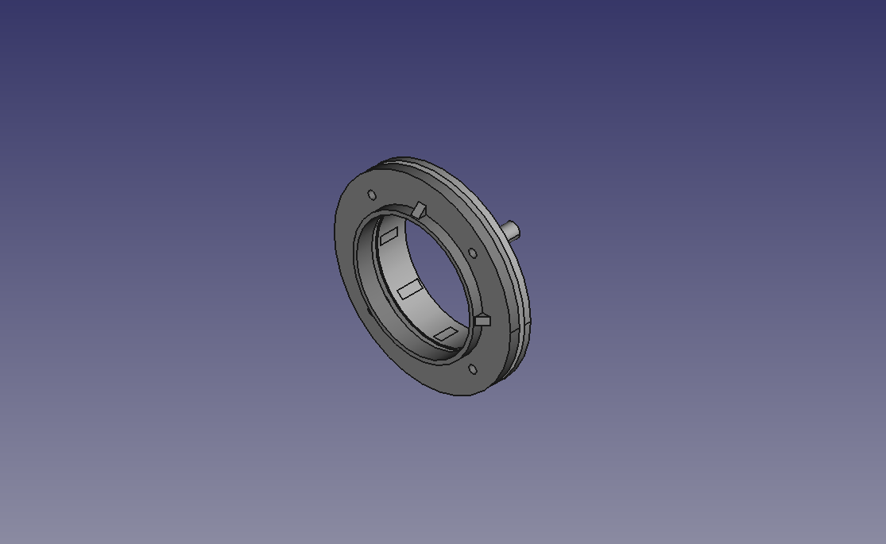

<!--
SPDX-FileCopyrightText: 2023 Tecnología de Raíz <tecnologiaderaiz@disroot.org>

SPDX-License-Identifier: CC-BY-NC-4.0
-->

# Diseño de antena direccional

## Desarrollo de diseños para construir una antena direccional

Con el presente diseño se busca conseguir una antena MiMo para 5Ghz direccional, capaz de alcanzar entre 20dB y 25dB de ganancia

En esta nueva iteración del diseño "Trompebólica", utilizamos una guía de ondas de 44mm con un reflector, para iluminar el plato parabólico.
Usamos de molde un plato parabólico de 40cm de diámetro y 8cm de alto, calculando el foco a los 12,5cm del centro.

### Reflector.

### Portareflector y soporte de parabola.

### Diseño final.

