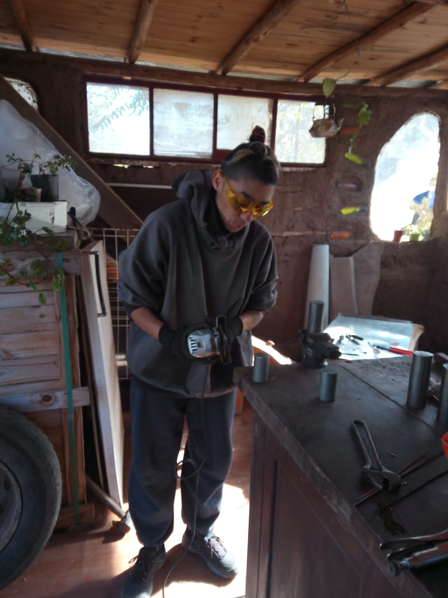
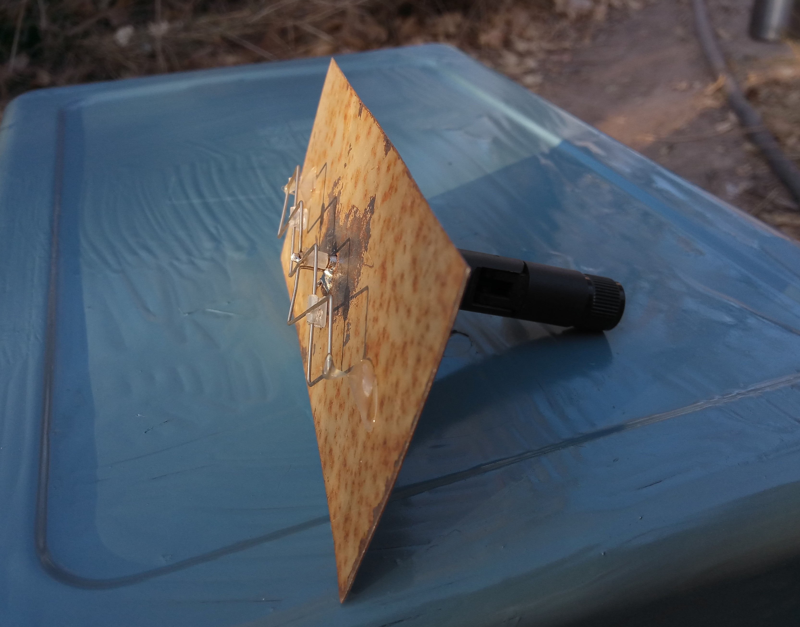
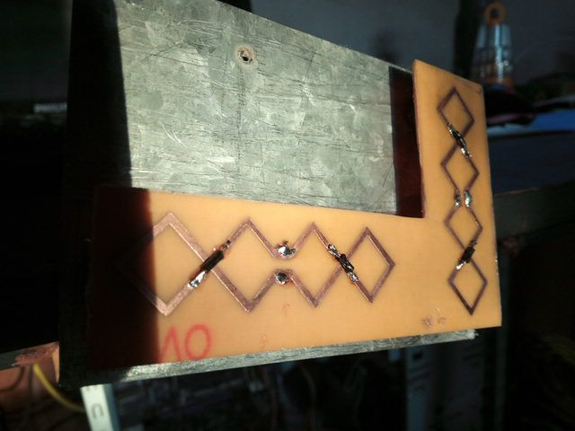

<!--
SPDX-FileCopyrightText: 2023 Tecnología de Raíz <tecnologiaderaiz@disroot.org>

SPDX-License-Identifier: CC-BY-NC-4.0
-->

# Tecnologia de raíz

## Te contamos de dónde partimos

## Somos TdR
   

Vecinxs del Barrio Ecológico "El Montecito" ubicado en el Valle de Punilla (Córdoba, Argentina)

Formamos un grupo de estudio e investigación, con el cual generamos un espacio para trabajar y estudiar en conjunto, y lo sostenemos de forma continua desde mediados del 2019.

 

Partimos de la curiosidad y el interés en compartir información acerca de electricidad, electrónica, tecnología y el derecho a las reparaciones.
Andando ese camino, en simultáneo se desplegó la red MonteNet en nuestro barrio, y comenzamos a aprender sobre redes comunitarias.

## Enfocamos nuestro interés en la investigación y desarrollo de antenas.

### Al conformarnos como grupo de trabajo, nuestra búsqueda es:

* Generar un prototipo de antena que se pueda reproducir facilmente.
* Generar un grupo de trabajo con perspectiva de género donde, a través de la comunicación, afianzar nuestros vínculos y así construir un espacio de trabajo armónico.
* Desarrollar nuestro emprendimiento con fines productivos, para que nos permita generar ingresos.

Utilizamos para eso un espacio de taller con una cantidad limitada de herramientas, que nos permiten desarrollar nuestra producción, pero nos gustaría poder mejorarlo, tanto en lo edilicio como sumando máquinas y herramientas.

---

Comenzamos el camino de investigación construyendo antenas doble biquad

Alguna de las cuales se encuentran instaladas en la red MonteNet 
ayudando a mejorar el enlace entre nodos.

Hemos construido algunas <a href="/paso_a_paso_sectorial.html">guía de ondas</a> para las redes comunitarias de nuestro territorio, y estamos trabajando en un emprendimiento productivo con las mismas, respondiendo a las necesidades de las redes, intentando crear un producto eficiente, de bajo costo y de producción local.

___

## En ese camino, nos encontramos con algunas dificultades:

* Las herramientas que tenemos no nos permiten mucha precisión, necesitamos trabajar más aún en el espacio del taller para optimizar el trabajo.

 * Las pruebas que realizamos fueron medidas con un programa que se desarrolló para tal fin, pero nos costó bastantes intentos adaptarlo y usarlo de manera óptima.

 * El escenario para las pruebas tiene muchas variables, además de estar compartido con otras personas de la comunidad y en altura.

---

## Desde hace un tiempo, estamos trabajando en estas tareas:

* Investigación y producción de prototipos de antenas funcionales a redes comunitarias de comunicación.

* Logística de LibreRouters, recepción testeo y envíos a nivel nacional.

*  Revisión de mails -pedidos y consultas sobre LibreRouters-

* Acompañamiento y asistencia técnica en la red MonteNet.

* Acompañamiento y promoción de redes comunitarias por la zona.

---
Nos motiva compartir conocimiento empoderante que facilite la apropiación tecnológica, y es por eso que trabajamos en el registro de nuestros procesos productivos, para poder compartirlos.
---

### Enlaces al contenido del proyecto LoPALiR:

* [.](paso_a_paso_sectorial.md){step}
* [.](Diseno_de_soporte_para_guia_de_ondas.md){step}
* [.](diseno_antena_direccional.md){step}
* [.](Como_hacer_una_antena.md){step}
* [.](Prototipado.md){step}
* [.](partes_plasticas.md){step}
* [Caracterización](Caracterizacion.md){step}
* [.](Pruebas-de-campo.md){step}
