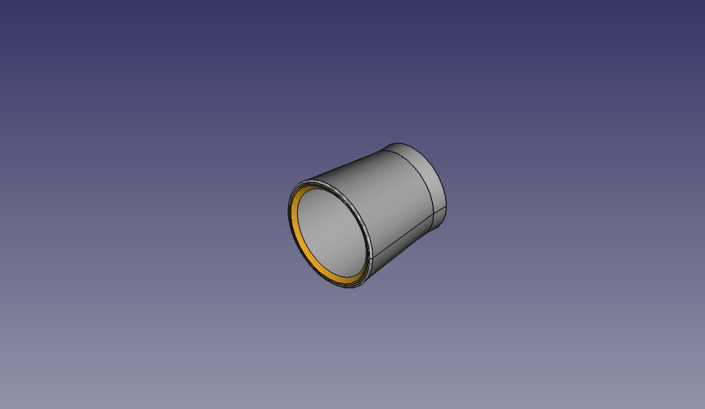
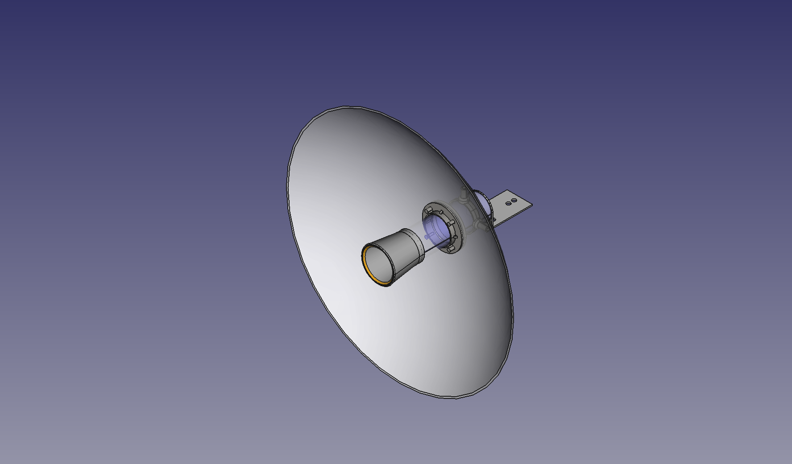

<!--
SPDX-FileCopyrightText: 2023 Tecnología de Raíz <tecnologiaderaiz@disroot.org>

SPDX-License-Identifier: CC-BY-NC-4.0
-->

#    Partes plásticas

En este material mostraremos los diseños y planos de las partes plásticas que complementan el proceso de producción de las antenas

    
La posibilidad de acceder a la impresion 3d como recurso nos habilito a poder crear nuestros propios moldes (matriceria) para facilitar el proceso de producción, así como construir insumos para las guías de ondas.

En principio, las partes plásticas surgieron de la necesidad de sustituir los regatones de plástico utilizados como tapas por tapas plásticas impresas en 3D.

Viendo el potencial de las impresiones 3D diseñamos un prototipo de portachain para sostener los cables de la antena, y también moldes para facilitar la perforacion de los caños de las guías de ondas.
    El portachain actual nos permite reemplazar procedimientos como soldadura o resinado, acortando los tiempos de producción y los costos también. El proceso hasta llegar a estos diseños y los diferentes prototipos previos están registrados <a href="/Prototipado.html">acá</a>
    Este proceso de investigación implicó familiarizarnos con las herramientas de diseño en Freecad y prácticas con la impresora. Actualmente estamos por acceder a una capacitación de la UTN (Universidad Técnica Nacional) para perfeccionar las impresiones.

    
<h3>
    <u>
        Tapas
    </u>
</h3>

Nuestro primer <a href="https://github.com/TecnologiadeRaiz/LoPALiR/blob/main/Partes%20plasticas/Tapas/TAPA-v1.FCStd">diseño</a> nos permitió mejorar el funcionamiento de la antena, ya que los regatones plásticos que usábamos como tapa interferían en la señal de las guías de ondas.
   
 

     
  
<h3>
    <u>
        Molde de perforación
    </u> 
</h3>
   
   

{color: #996699}
Este <a href="https://github.com/TecnologiadeRaiz/LoPALiR/tree/main/Partes%20plasticas/Molde%20de%20perforacion">diseño</a> nos aporta precisión a la hora de realizar las perforaciones en la guía de ondas, agilizando el proceso de producción.

        

 

<h3>
    <u>
        Portachain
    </u>
</h3>

La posibilidad de diseñar <a href="https://github.com/TecnologiadeRaiz/LoPALiR/tree/main/Partes%20plasticas/PORTACHAIN">estas piezas</a> nos permitió optimizar la forma de sujetar los cables, que se presentaba como un desafìo en los prototipos anteriores, significando un costo y tiempos de producción más alto.
    
El primer diseño resultaba frágil, dado que el material que usábamos, filamento PLA, no era adecuado para las antenas, ya que se encuentran expuestas al sol, la lluvia y el viento.

La segunda versión de portachain fue diseñada teniendo en cuenta el aumento de espesor de la pieza para darle más solvencia, y el material, que fue reemplazado por filamento PETG.

    
Los primeros diseños no nos permitían sostener los cables de la forma esperada.

Luego descubrimos que para darle terminación y un mejor agarre, debíamos anexar al portachain un aro de caño de aluminio de 3/8 crimpeado, aportandole así la firmeza esperada para sujetar los cables.

    
<h3>
    <u>
        Pintura
    </u>
    </h3>

Para darle terminación a las antenas, utilizamos pintura sintética.
Nuestra primera experiencia fue utilizando una pintura para automóviles sobre una capa de pintura antióxido.
Notamos que la misma tenía caracterísiticas como:

<ul>
    <li>
        Ser muy resistente
    </li>
    <li>
        Más espesor
    </li>
    <li>
        Mayor valor
    </li>
</ul>

Encontramos dificultades para lograr la dilusión justa para utilizarla, y no lograbamos una buena terminación.

Es por eso que decidimos probar con pintura "tres en uno" que tiene características como:

<ul>
    <li>
        Convertidor (trabaja sobre las partes oxidadas)
    </li>
    <li>
        Previene el óxido
    </li>
    <li>
        Esmalta las piezas
    </li>
</ul>

Por estas características y la facilidad para diluirse y su poder cubritivo, actualmente estamos utilizando esta pintura como revestimiento para nuestros modelos.
Para más información sobre el procedimiento, entrá <a href="https://tdr.libre.org.ar/5-como-hacer-una-antena-guia-de-ondas-descripcion-de-nuestro-espacio-de-trabajo/">acá</a>.

    
 
    

<h3>
    <u>
        Antena terminada con sus partes plásticas
    </u>
</h3>
    
    

### Acoples para el diseño de antena direccional

Hemos desarrollado algunas partes complementarias a la guía de ondas con el fín de aumentar su directividad.
Los ultimos ensayos confirman que alcanza un promedio aproximado de 13dB en una dirección.

Los soportes de la parábola permiten añadir el reflector secundario de 16 pulgadas a la guía de ondas. La nariz también cubre el interior del tubo y sujeta el reflector primario en la zona focal de la parábola.
Solo la "nariz" tarda 5 horas en imprimirse, en total las piezas necesarias demoran casi 8 horas en materializarse.

---

This project was funded through the <strong> <a href="https://nlnet.nl/useroperated/">User-Operated Internet</a> </strong> fund, a fund established by <a href="https://nlnet.nl">NLnet</a> made possible by financial support from the <a href="https://pkt.cash" rel="nofollow">PKT Community</a> <a href="https://pkt.cash/network-steward" rel="nofollow">The Network Steward</a> and stichting <a href="https://technologycommons.org">Technology Commons Trust</a>.
 

Saludamos a les amigues de <a href="https://altermundi.net/">AlterMundi.</a>

